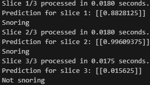
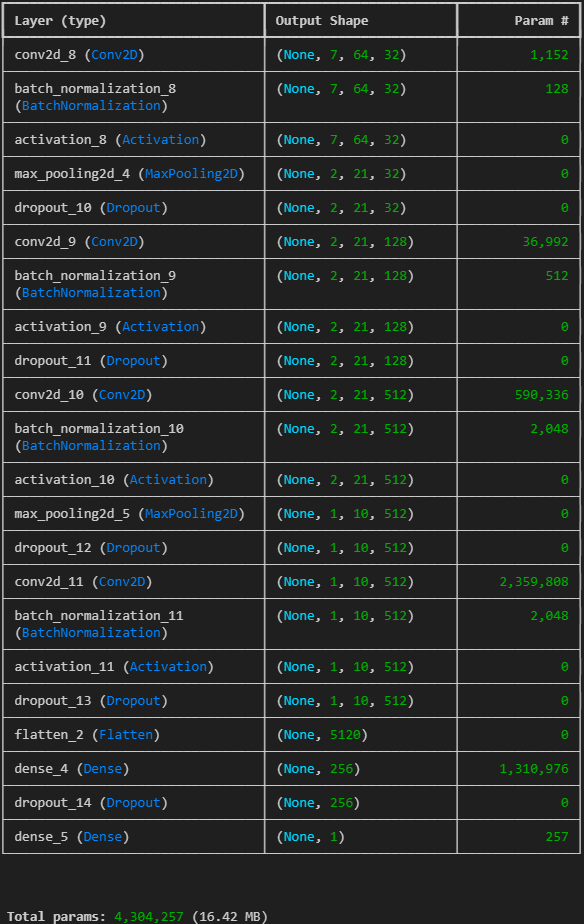
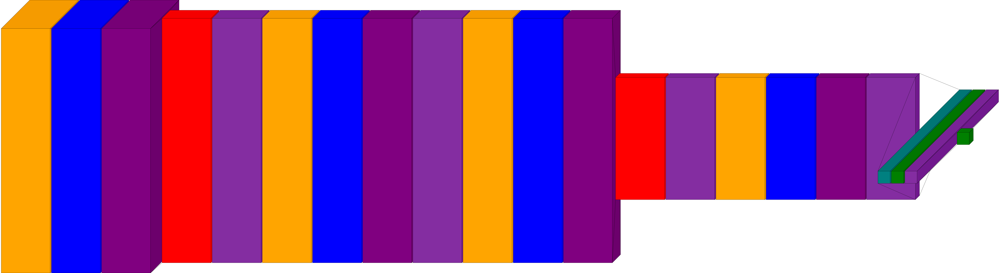
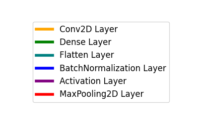

# Snoring detection

# Описание модели
Модель обучена на датасете, состоящим из звуковых .wav файлов храпа и других звуков продолжительностью 1 секунда, из-за чего файлы с большей продолжительностью разделяются на части по 1 секунде, далее на каждом из них идет предсказание модели.

Вес модели до квантизации - 14мб.
После квантизации модель уменьшаяется примерно в 4 раза.

# Архитектура модели

